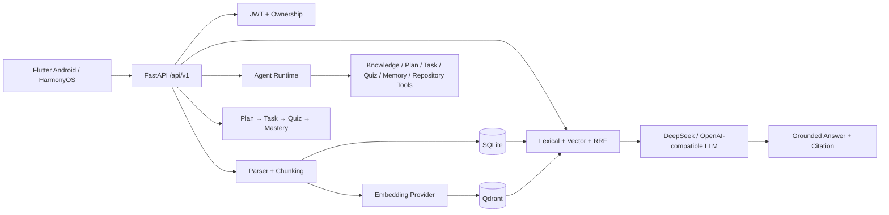

# KnowFlow AI

[](https://github.com/Changxin-YR/AI-learning-knowledge-base/actions/workflows/ci.yml)
[](https://github.com/Changxin-YR/AI-learning-knowledge-base/releases)

KnowFlow AI 是一个面向大学生与开发者的 **AI 学习知识库**：Flutter 客户端覆盖 Android 与 HarmonyOS/OpenHarmony，FastAPI 后端负责鉴权、文档解析、RAG、Agent Tool Calling、长期记忆、Repository Learning 与学习闭环。项目的目标不是只做聊天 Demo，而是把“资料进入系统 → 可追溯检索 → AI 回答 → 学习计划 → Task → Quiz → Mastery”做成可验证的完整链路。

> `v1.0.0` 已完成 Android API34 Emulator 与 HarmonyOS Emulator 验收。最终证据和发布产物见 `docs/ROUND7_FINAL_PASS_REPORT.md` 与 GitHub Releases。

## 核心能力

- **多格式知识库**：TXT / Markdown / PDF / DOCX / PPTX 真实解析、切片、索引、删除与引用追溯。
- **Hybrid RAG**：Lexical + Qdrant Vector Retrieval + Reciprocal Rank Fusion，支持用户/知识库级向量过滤和相似度阈值。
- **可追溯回答**：回答返回 document/chunk citation；无相关内容时避免强行附加无关引用。
- **DeepSeek / OpenAI-compatible LLM**：服务端 Provider 接入，v1.0 验收中已完成真实 DeepSeek Tool Calling 与 RAG 验证。
- **Agent Runtime**：JSON Schema 参数校验、Service dispatch、读写 Tool、`agent_runs` / `tool_calls` 审计，不允许 Agent 任意执行 SQL。
- **Long-term Memory**：CRUD、检索、删除、用户隔离，可由 Agent 保存和召回学习上下文。
- **Repository Learning**：仅允许公开 GitHub/GitLab/Gitee 仓库；DNS/IP SSRF 防护、禁止 Git redirect、shallow clone、静态分析 README/依赖/入口/源码并写入知识库。
- **学习闭环**：学习计划、Task、Quiz、Mastery 与多轮 Conversation。
- **双端文件选择**：Android 使用稳定系统 Picker；HarmonyOS 对系统 Picker 异常提供兼容路径，保持真实文件选择与上传。
- **离线降级**：Qdrant 不可用时保留 lexical fallback；云模型未配置时仍可运行 deterministic/demo 流程。

## 架构



详细设计见 [`docs/ARCHITECTURE.md`](docs/ARCHITECTURE.md)、[`docs/RAG.md`](docs/RAG.md) 和 [`docs/AGENT.md`](docs/AGENT.md)。

## 技术栈

| 层 | 技术 |
|---|---|
| Mobile | Flutter / Dart / Material 3 / CPF-Flutter HarmonyOS 工具链 |
| Backend | Python / FastAPI / Pydantic |
| Auth | JWT / Argon2id / Resource ownership checks |
| Relational data | SQLite（本地可重复演示） |
| Vector store | Qdrant |
| LLM | OpenAI-compatible Provider；已验证 DeepSeek |
| Embedding | deterministic local / OpenAI-compatible / optional local neural service |
| Document parsing | pypdf / python-docx / python-pptx |
| Infra | Docker Compose |
| QA | pytest / flutter analyze / flutter test / emulator E2E / GitHub Actions |

## 快速启动

### 1. 基础服务

```powershell
.\scripts\start-infra.ps1
.\scripts\start-backend.ps1
```

后端默认使用 `server/data/knowflow.db`，不依赖外部账号即可演示。

Demo 账号：

```text
Email: demo@knowflow.local
Password: KnowFlowDemo123!
```

### 2. Flutter

Android Emulator：

```powershell
cd mobile
flutter run --dart-define=API_BASE_URL=http://10.0.2.2:8001
```

HarmonyOS 的构建与验收说明见 [`docs/OHOS_ACCEPTANCE.md`](docs/OHOS_ACCEPTANCE.md)。

## DeepSeek / 云模型

不要把 API Key 写入 Flutter 或提交到 Git。后端使用 OpenAI-compatible 配置：

```env
DEMO_AI_MODE=0
OPENAI_BASE_URL=<provider-base-url>
OPENAI_API_KEY=<secret>
OPENAI_MODEL=<model-name>
```

`v1.0.0` 的真实 Provider 验收使用 DeepSeek；CI 不依赖外部付费 API。

## RAG 模式

```env
RAG_MODE=lexical   # 只使用词法检索
RAG_MODE=vector    # 只使用向量检索
RAG_MODE=hybrid    # 默认：Lexical + Vector + RRF
```

默认 `EMBEDDING_PROVIDER=local` 是可重复测试用的确定性离线向量，不代表神经语义质量。

### 可选：本地神经 Embedding

安装额外依赖：

```powershell
cd server
pip install -r requirements-neural.txt
```

启动本地 OpenAI-compatible Embedding 服务：

```powershell
uvicorn neural_embedding_service:app --host 127.0.0.1 --port 8002
```

再让主后端连接它：

```env
EMBEDDING_PROVIDER=openai
EMBEDDING_BASE_URL=http://127.0.0.1:8002
EMBEDDING_API_KEY=
EMBEDDING_MODEL=sentence-transformers/paraphrase-multilingual-MiniLM-L12-v2
QDRANT_COLLECTION=knowflow_chunks_neural_384
```

本地神经服务默认使用 multilingual MiniLM，并通过独立 Qdrant collection 避免与 256 维 deterministic collection 发生维度冲突。

## RAG 质量评测

项目内置多语言、代码、Repository、安全、学习、Memory、Agent 与无答案问题的评测集：

```powershell
python scripts/rag-eval.py
```

默认输出：

```text
artifacts/rag-eval/latest.json
```

指标包括：

- Recall@3
- Recall@5
- MRR
- Citation Hit Rate
- No-answer false citation rate

切换 neural embedding 后再次执行同一个评测，可直接比较 Lexical / Vector / Hybrid 是否真实提升。

## 自动化质量门禁

本地：

```powershell
.\scripts\test-all.ps1
.\scripts\build-all.ps1
```

GitHub Actions 在 Pull Request 和 `main` push 上自动执行：

- Python 3.13 backend pytest
- Flutter 3.27.4 `flutter analyze`
- Flutter widget tests

Dependabot 每周检查 Python、Flutter/pub 与 GitHub Actions 依赖更新。

## v1.0.0 验收结果

| Gate | Result |
|---|---|
| Backend | 20 passed |
| Flutter analyze | PASS |
| Flutter tests | 5 passed |
| Android API34 Emulator | PASS |
| Android File Picker | PASS |
| HarmonyOS H01-H27 | 24 PASS / 3 N/A / 0 FAIL |
| HarmonyOS Compatibility Picker | PASS |
| Qdrant Live | PASS |
| DeepSeek Provider | PASS |
| Agent Read / Write | PASS |
| Memory | PASS |
| Android APK | PASS |
| HarmonyOS x64 HAP | PASS |
| HarmonyOS ARM64 HAP build | PASS |

完整报告：[`docs/ROUND7_FINAL_PASS_REPORT.md`](docs/ROUND7_FINAL_PASS_REPORT.md)

正式发布：[`v1.0.0`](https://github.com/Changxin-YR/AI-learning-knowledge-base/releases/tag/v1.0.0)

## 安全边界

- 所有用户资源通过服务端 ownership 校验。
- Agent 只能调用注册的 Service Tool，不允许直接操作数据库。
- Repository import 仅接受公开白名单 Host，并执行 DNS/IP 检查、大小/数量/超时限制。
- `.env`、API Key、keystore、证书和本地签名配置均禁止提交。
- 生产环境拒绝默认 JWT Secret。

## 当前范围

`v1.0.0` 已验证模拟器工程闭环；以下不作为该版本的 PASS 门禁：

- Android/HarmonyOS 物理设备认证
- ARM64 物理运行验证
- Google Play / AppGallery 正式生产签名
- 付费 Neural Embedding Provider

这些能力将在后续 release branch 中独立验证，不修改已经冻结的 `v1.0.0`。

## 面试 / 作品集材料

- [`docs/RESUME.md`](docs/RESUME.md)：简历描述与面试讲解
- [`docs/ARCHITECTURE.md`](docs/ARCHITECTURE.md)：架构与数据流
- [`docs/RAG.md`](docs/RAG.md)：RAG 与降级策略
- [`docs/RAG_EVAL.md`](docs/RAG_EVAL.md)：检索评测方法
- [`docs/FINAL_ACCEPTANCE_REPORT.md`](docs/FINAL_ACCEPTANCE_REPORT.md)：最终验收

## License / Usage

请根据仓库实际许可证与使用计划使用本项目；发布前应补充明确的 LICENSE 文件与第三方依赖许可证检查。
