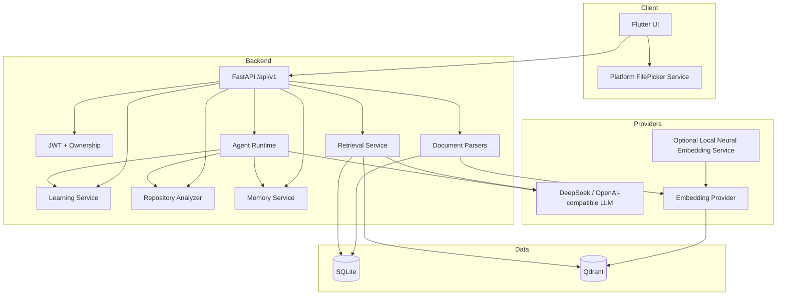

# Architecture

## 1. Overview

KnowFlow AI is a Flutter + FastAPI learning knowledge-base system designed around an evidence-backed flow rather than a chat-only demo:

```text
File / Repository
      ↓
Parse + Chunk
      ↓
SQLite metadata + Qdrant vectors
      ↓
Lexical / Vector / Hybrid retrieval
      ↓
Grounded LLM answer + citation
      ↓
Plan → Task → Quiz → Mastery
      ↓
Agent + Long-term Memory
```

Flutter provides the Android/HarmonyOS client. FastAPI owns authentication, authorization, parsing, retrieval, model access, learning state, repository analysis, memory and Agent execution. The mobile client never receives model-provider secrets or direct database access.

## 2. Runtime Components



## 3. Mobile Layer

The Flutter client uses a small Dart API layer and feature UI for:

- Home/dashboard
- AI conversation and citations
- Knowledge bases and document management
- Learning plans/tasks
- Quiz/mastery
- Profile/session management

Android and HarmonyOS share Dart business UI. Platform-specific file selection is isolated behind a picker service. HarmonyOS includes a compatibility path because emulator system `FilePickerUIExtAbility` behavior is not identical to Android DocumentsUI.

## 4. Backend Layer

FastAPI exposes `/api/v1` and owns all privileged operations.

### Authentication & authorization

- JWT access tokens
- Argon2id password hashing
- production refusal of the default JWT secret
- resource ownership checks for KB, document, conversation, task, memory and vector retrieval

The authorization boundary is server-side; client-visible IDs are never trusted as proof of ownership.

### Document ingestion

Supported ingestion includes:

- TXT / Markdown / UTF-8 source files
- PDF via `pypdf`
- DOCX via `python-docx`
- PPTX via `python-pptx`

The server validates extension, basename, size, parser errors and extractable text before chunking.

## 5. Data Layer

### SQLite

SQLite is the default relational store for a reproducible local demo and acceptance environment. It owns:

- users / refresh tokens
- knowledge bases / documents / chunks
- conversations / messages
- study plans / tasks
- quizzes / attempts / mastery
- repository imports
- memories
- agent runs / tool calls

`SQLITE_PATH` selects the database location. Tests use isolated temporary databases.

### Qdrant

Qdrant stores chunk vectors. Every point payload includes:

- `user_id`
- `knowledge_base_id`
- `document_id`
- `chunk_id`

Vector queries filter by authenticated user and optionally by knowledge base. SQLite ownership is rechecked when converting Qdrant result IDs back to relational rows.

Qdrant is optional at runtime: if it is unavailable, lexical retrieval remains available instead of crashing the application.

## 6. RAG

The retrieval pipeline supports three modes:

```text
RAG_MODE=lexical
RAG_MODE=vector
RAG_MODE=hybrid
```

The default hybrid path uses:

```text
Lexical ranking
      +
Vector ranking
      ↓
Reciprocal Rank Fusion (RRF)
      ↓
Top chunks
      ↓
LLM grounding context
      ↓
Answer + citation
```

Vector similarity uses a configurable threshold so nearest-neighbor search does not automatically become a citation when the match is weak.

Embedding backends are intentionally separated from retrieval:

- `local`: deterministic offline vectors for CI and repeatable tests
- `openai`: OpenAI-compatible `/embeddings` endpoint
- optional local neural service: Sentence Transformers exposed through the same compatible endpoint

This lets CI stay deterministic while allowing semantic-quality experiments without changing the application contract.

## 7. Agent Runtime

The Agent does not have arbitrary SQL or shell access. The flow is:

```text
User message
  ↓
Model tool selection
  ↓
Tool schema validation
  ↓
Registered service dispatch
  ↓
Tool result
  ↓
Model final response
```

Tool execution records `agent_runs` and `tool_calls` for auditability. Read/write tools reuse the same service-layer ownership rules as manual API operations.

## 8. Long-term Memory

Memory is user-owned data with explicit types such as preference, learning goal, weak knowledge, project context and user note. CRUD/search operations enforce ownership. The Agent may save or retrieve memory through registered tools rather than direct database access.

## 9. Repository Learning

Repository ingestion is static-only and does not execute third-party source code.

Security controls include:

- public GitHub/GitLab/Gitee allowlist
- DNS resolution before clone
- rejection of private/loopback/link-local/reserved addresses
- Git HTTP redirects disabled
- shallow clone
- submodules disabled
- clone timeout
- maximum file count, single-file size and aggregate size

The analyzer reads source tree, README, dependency manifests and likely entry points, then indexes useful text as knowledge-base material.

## 10. Provider Boundary

LLM and embedding secrets stay on the backend.

The OpenAI-compatible boundary was intentionally chosen so the application can use DeepSeek or other compatible providers without coupling Flutter or Agent business logic to one vendor.

CI never requires paid provider keys.

## 11. Quality & Release Boundary

The repository now contains GitHub Actions gates for backend pytest and Flutter analyze/test. The frozen `v1.0.0` release was validated with:

- Android API34 Emulator
- HarmonyOS Emulator
- Qdrant live runtime
- DeepSeek live provider flow
- Android APK
- HarmonyOS x64 HAP
- HarmonyOS ARM64 build

Physical-device certification and store production signing remain separate release-engineering work, not hidden assumptions of the current simulator acceptance.
